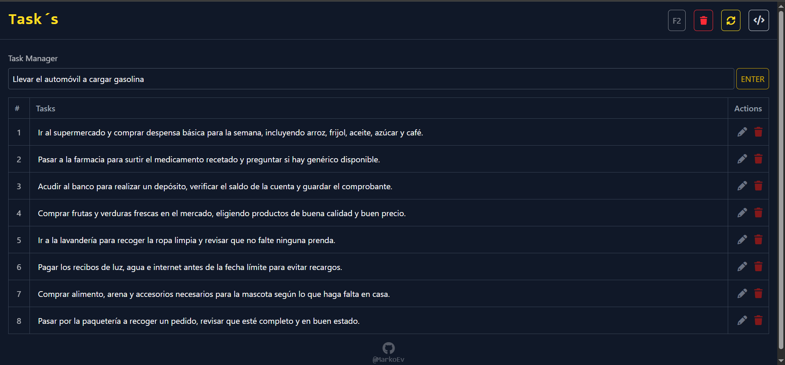
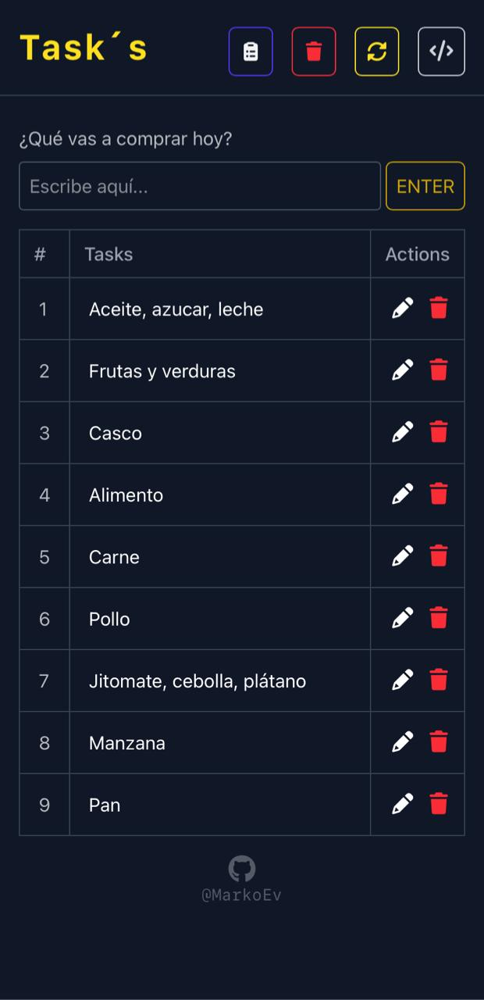

# TasksManager 📋

Aplicación web **responsive** enfocada en la gestión eficiente de tareas.  
Desarrollada con **HTML, Tailwind CSS y JavaScript**, aplicando **buenas prácticas de desarrollo**, código modular, funciones reutilizables y persistencia de datos mediante **LocalStorage**.

---

## 🌐 Demo

🔗 **Sitio en línea:** [https://listtasksapp.netlify.app/](https://listtasksapp.netlify.app/)

---

## ✨ Características Principales

* 📝 Gestión de Tareas

- Agregar, editar y eliminar tareas
- Persistencia de datos con localStorage
- Contador automático de tareas

* ⌨️ Atajo de Teclado

- Presiona F2 para enfoque rápido del input

* 🎨 Interfaz
 
- Diseño responsive (móvil y desktop)
- Tabla interactiva con animaciones
- Tailwind CSS + Font Awesome

---

## 🛠️ Tecnologías usadas

* 🌐 **HTML5**
* ⚡ **JavaScript**
* 🎨 **Tailwind CSS**
* 💾 **LocalStorage API**
* ⭐ **Font Awesome**

---

## 📂 Estructura del proyecto

```bash
taskmanager/
├── index.html
├── js/
│   └── app.js
│   └── theme.js
└── img/
    └── logo.png
    └── icon.png
    └── captures/
        └── movil.jpg
        └── desktop.jpg  
```

---

## 🚀 Instalación y uso

1️⃣ Clona el repositorio:

```bash
git clone https://github.com/MarkoEv/taskmanager.git
```

2️⃣ Entra al proyecto:

```bash
cd taskmanager
```

3️⃣ Abre el proyecto en tu navegador:

* Abre el archivo `index.html`

---
## 📸 Capturas





## 👤 Autor

**Marco Antonio Evangelista Armenta**
- Desarrollador Web

---
